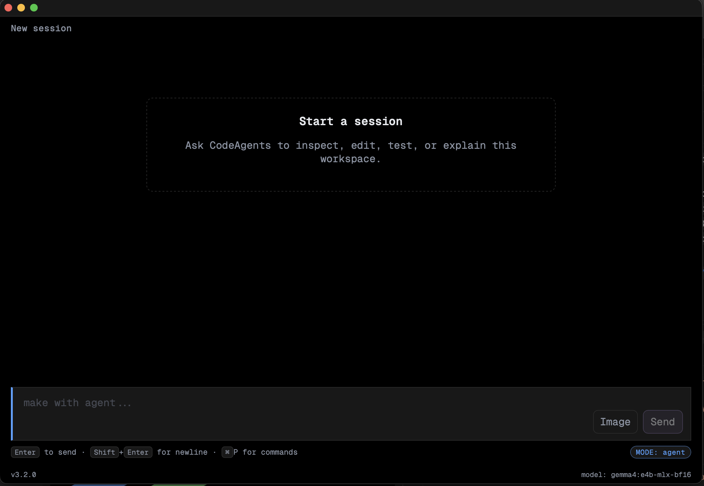

<h1 align="center">
  
  &nbsp;CodeAgents
</h1>

<p align="center">
  
</p>

A local-first agent platform for macOS (Apple Silicon). One desktop app
hosts four agent modes — **agent**, **plan**, **ask**, **research** —
that share the same workspace, tool registry and HTTP backend. All
inference is routed through an OpenAI-compatible local runtime
([Ollama](https://ollama.com), [llama.cpp](https://github.com/ggerganov/llama.cpp)
or [MLX](https://github.com/ml-explore/mlx)). No SaaS, no telemetry, no
key needed for the core flow.

The product surface (chat, command palette, plans, deep research,
Markdown rendering) was inspired by [opencode](https://github.com/opencode-ai/opencode);
the LSP / RAG / KG / MCP layers are our own.

## Use

### Install

Requires macOS 13+, Python 3.11+, Node 18+ and Ollama already running on
`http://localhost:11434`.

```bash
git clone https://github.com/<you>/CodeAgents.git
cd CodeAgents
bash scripts/install_app.sh   # builds .venv, gui bundle, ca-services, .app
```

The script:

1. creates `./.venv` and installs the Python package in editable mode;
2. builds the Rust services helper (`ca-services`);
3. builds the React GUI (`gui/dist/`);
4. assembles `/Applications/CodeAgents.app` with everything bundled.

To upgrade after a `git pull`, run `bash scripts/update.sh`.

### Run

```bash
open /Applications/CodeAgents.app
```

That's it — the app boots `ca-services` (which launches Ollama if it
isn't already up) and the Python backend on `http://127.0.0.1:8765`.

You can also run the backend directly from the repo:

```bash
.venv/bin/codeagents serve --port 8765
# CLI:
.venv/bin/codeagents ask "что ты умеешь?"
.venv/bin/codeagents tools
.venv/bin/codeagents index .
```

By default the runtime expects an OpenAI-compatible server at
`http://localhost:11434/v1`. Edit `config/models.toml` to change it.

## Modes

Four modes live side-by-side. They share the workspace and chat history
but differ in **(a)** which tools are exposed, **(b)** which permission
classes are allowed, and **(c)** the system prompt. All three live in
code/JSON files you can edit — see "Tools" and "Prompts" below.

| Mode | Color | Permissions | Purpose |
|------|-------|-------------|---------|
| **agent** | blue | read / write / network / safe shell / propose | full-power coding agent (default mode on launch). |
| **plan** | orange | read / propose | designs a multi-step plan and pins it to the chat banner; cannot mutate files. |
| **ask** | green | read | strict read-only Q&A over the workspace + the web. |
| **research** | pink | read / propose | structured deep-research pipeline (clarify → outline → search/extract → drafts → assembled report). |

Tab cycles between modes; the accent colour, available tools and system
prompt swap automatically.

### research mode in detail

`research` is the most opinionated mode. It implements a 4-phase
pipeline driven entirely through chat (no popups):

1. **Clarify (chat-only).** On the very first turn the model replies
   with 3-4 short clarifying questions and stops. No tool calls. The
   user answers in chat as plain text.
2. **Plan.** The model calls `plan_research(query=…)` and receives a
   3-6 section outline. The plan is stored under `report_id`.
3. **Per-section research loop.** For each section: `expand_query` →
   `web_search` → `web_fetch` → `extract_facts(report_id, section_idx)`.
   Stops after 3 iterations, when no new claims are extracted, or when
   ≤ 1k tokens of headroom remain.
4. **Draft + assemble.** `draft_section(report_id, section_idx)` per
   section, then `assemble_report(report_id)` concatenates everything
   into `report.md` with `[n]` citations resolving to `report.sources`.

The mode also has read-only access to the **knowledge graph**
(`kg_query`, `kg_resolve_conflicts`) so cross-report claims can be
de-duplicated.

## Tools

### Where they live

The native tool surface is in `src/codeagents/tools/`:

```
tools/
├── _registry.py         # ToolSpec / ParamSpec / ToolRegistry types
├── _native_specs.py     # SINGLE SOURCE OF TRUTH for descriptions seen by the model
├── native_code.py       # thin handler-registration wiring
├── filesystem.py        # read_file / write_file / edit_file / ls / grep / glob / rm / ...
├── shell.py             # bash, run_python, conda_*, run_tests + subprocess helpers
├── web.py               # web_fetch / web_search / curl / docs_search + provider stack
├── git.py               # git_diff / git_status
├── plans.py             # create_plan / patch_plan / mark_step / list_plans
├── workspace_ctl.py     # cd / change_workspace
├── rag.py               # search_code (vector+lexical) / recall_chat
├── lsp.py               # lsp_definition / lsp_references / lsp_hover / lsp_workspace_symbol / lsp_diagnostics
├── code_context.py      # umbrella tool combining LSP + RAG
├── pdf.py               # read_pdf
├── kg.py                # knowledge-graph add/query/resolve
└── research.py          # plan_research / expand_query / extract_facts / draft_section / assemble_report
```

### CRUD a tool

**Create:**

1. Write the handler — a function `(workspace, args) -> dict` — in the
   subsystem file that fits (e.g. `tools/filesystem.py`).
2. Add a `ToolSpec(name=..., kind="native", permission=...,
   description=..., params=(ParamSpec(...), ...))` entry to
   `tools/_native_specs.py`. The description shown there is what the
   model literally sees; include `Example: tool_name {"arg":"value"}`
   lines so `tests/test_tool_descriptions.py` stays green.
3. In `tools/native_code.py::register_code_tools` register the handler
   with the same name. The shared `ToolSpec` from `_native_specs.py`
   merges in automatically.
4. Add the name to `_MODE_TOOLS[<mode>]` in
   `src/codeagents/core/modes/__init__.py` for every mode that should
   see it. (Note: `agent` mode uses an empty tuple = "open mode" and
   gets every enabled tool; to *restrict* it, list names explicitly.)

**Read:** `GET /tools` returns the per-mode payload the GUI palette uses.
Or run the CLI: `.venv/bin/codeagents tools`. In the desktop app:
`⌘P → Available tools → <mode>`.

**Update:** edit the description / params in `_native_specs.py` and
the handler in its subsystem module. Bump permission class only after
re-checking which modes are still allowed to use the tool (see
`_MODE_PERMISSIONS`).

**Delete:** remove from `_native_specs.py`, the registration in
`native_code.py`, the handler, and any `_MODE_TOOLS` entries.

### Mode whitelists

Edit `src/codeagents/core/modes/__init__.py`:

- `_MODE_TOOLS["<mode>"]` — explicit tuple of tool names (or `()` for
  open mode, where every enabled tool is exposed).
- `_MODE_PERMISSIONS["<mode>"]` — `frozenset[Permission]` of allowed
  permission classes; this gate runs *in addition* to the whitelist.
- `_MODE_COLORS["<mode>"]` — UI accent colour.

Running tests after edits is a good idea; many tests assert specific
tool names appear in specific modes.

## Models & prompts

### Adding a model

1. Pull the weights into Ollama (or your runtime) and verify with
   `ollama list`.
2. Add an entry to `config/models.toml`:

   ```toml
   [models.code_local]
   name = "qwen2.5-coder:7b"
   role = "coding-fast"
   context_tokens = 16384
   temperature = 0.1
   notes = "Fast 7B model for quick edits."
   ```

3. Optional: drop a `.toml` profile into `registry/model_params/` for
   runtime knobs (rope, batch size, system tokens, etc.). See the
   examples already there.
4. Restart the backend; the model appears in the GUI model picker.

### Writing a system prompt for a model

System prompts live as JSON under `registry/prompts/modes/<mode>.json`:

```json
{
  "default": "<full system prompt for this mode>",
  "models": {
    "qwen3-coder":          "<full prompt with model-specific tweaks>",
    "qwen3-coder:480b":     "<even more specific override>"
  }
}
```

The resolver (`src/codeagents/core/modes/prompts.py::resolve_prompt`)
picks the first non-empty match in this order:

1. exact `<name:tag>`,
2. `<family>` (everything before `:`),
3. the mode's `default`.

Per-model entries are *full replacements*, not appendices — keep that in
mind when overriding. Edit the JSON, save, the next chat sees the new
prompt (`reload_prompts()` is called per request).

## Development

Run from the repo root.

```bash
# Run the test suite (one pre-existing eval test is deselected).
python -m pytest -q --deselect tests/test_evals_manifest.py

# A single file or test:
python -m pytest -q tests/test_web_tools.py
python -m pytest -q tests/test_web_tools.py::test_web_fetch_uses_jina_and_cache

# Check that all Python sources compile (syntax-only, fast).
python -m compileall -q src tests

# Check that the package builds and imports cleanly.
python -m pip install -e .
python -c "import codeagents; print(codeagents.__version__)"

# Smoke-check that the tool subsystems wire together.
python -c "from codeagents.tools import native_code, web, shell, filesystem; print('ok')"

# Rebuild the GUI after changing anything under gui/.
(cd gui && npm run build)

# Full app rebuild (.venv + cargo + gui + .app bundle).
bash scripts/install_app.sh
```

`POST /chat/upload` saves a base64 file into `<workspace>/.codeagents/`.
`GET /metrics/resources` returns Ollama on-disk and live model snapshots
plus GPU info via `nvidia-smi`.

## Acknowledgements

CodeAgents stands on shoulders. Worth a star:

- **[Ollama](https://github.com/ollama/ollama)** — the local runtime
  every chat ultimately talks to; `web_search` / `web_fetch` Cloud
  endpoints are also used when an Ollama key is present.
- **[opencode](https://github.com/opencode-ai/opencode)** — UX
  inspiration for the command palette, the compact tool surface, and
  the Tab-based mode switcher.
- **[llama.cpp](https://github.com/ggerganov/llama.cpp)** and
  **[MLX](https://github.com/ml-explore/mlx)** — alternative local
  runtimes both supported via the OpenAI-compatible adapter.
- **[Pyright](https://github.com/microsoft/pyright)**,
  **[rust-analyzer](https://github.com/rust-lang/rust-analyzer)** and
  **[tsserver](https://github.com/microsoft/TypeScript)** — the LSP
  servers powering `code_context` / `lsp_*` tools.
- **[sqlite-vec](https://github.com/asg017/sqlite-vec)** —
  embeddings / vector index for `search_code` and `recall_chat`.
- **[BeautifulSoup](https://www.crummy.com/software/BeautifulSoup/)**
  & **[markdownify](https://github.com/matthewwithanm/python-markdownify)**
  — HTML → Markdown for `web_fetch`.

The deep-research pipeline draws on
[local-deep-research](https://github.com/LearningCircuit/local-deep-research)
and the survey work in
[arxiv.org/abs/2506.12594](https://arxiv.org/abs/2506.12594),
[arxiv.org/abs/2504.21776](https://arxiv.org/abs/2504.21776),
[arxiv.org/abs/2508.12752](https://arxiv.org/abs/2508.12752).

## Documents

- `docs/architecture.md` — system architecture and module boundaries.
- `docs/gui-architecture.md` — GUI shell, IPC and bundle layout.
- `docs/interaction.md` — user interaction model and trust boundary.
- `docs/indexing.md` — local code/file indexing strategy.
- `docs/local-inference-service.md` — shared local inference service.
- `docs/runtime.md` — Ollama, llama.cpp and MLX setup.
- `docs/services_manager.md` — `ca-services` (launching, logging, profiling).
- `docs/speech-future-plan.md` — ASR / TTS plans (out of current scope).
- `docs/terminal_cli.md` — install and use the Rust `ca` terminal client.
- `docs/references/ollama/` — mirrored Ollama docs (tool calling, web search, integrations) plus `llms.txt` index.
- `docs/research/AGENT_SYSTEMS_READING_LIST.md` — curated reading list.
