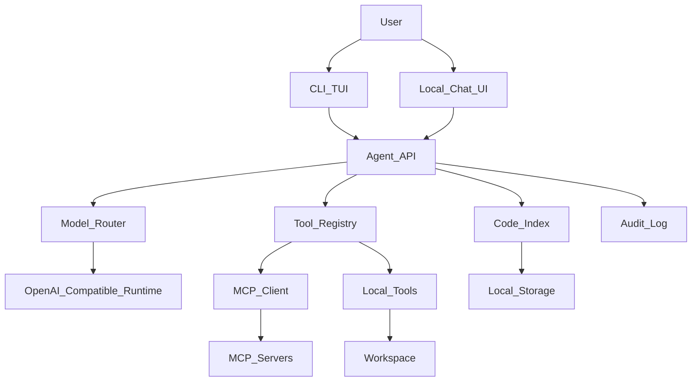

# Local Agent Architecture

## Goals

Build a local agent platform that can run on a MacBook M3 Max with 36 GB unified memory and use models that fit roughly within a 20 GB quantized footprint.

The first version focuses on:

- A local coding agent for repository work.
- A general local chat agent for everyday questions.
- Fast model swapping through OpenAI-compatible runtimes.
- MCP-backed integrations for tools that are already standardized in the ecosystem.

Speech and ASR are intentionally not implemented in the MVP.

## High-Level Shape

## Components

`runtime`
: External local model server. First targets are Ollama, llama.cpp server, and MLX-based wrappers if they expose an OpenAI-compatible API.

`agent-core`
: Python orchestration layer: prompts, model routing, tool loop, permissions, session state, and audit log.

`tool-registry`
: A unified registry for internal tools and MCP-imported tools. The agent loop talks to one interface regardless of whether a tool is native Python, Rust, or MCP.

`mcp-client`
: MCP integration layer. It imports MCP server tools/resources as normal tool specs with JSON schemas, permission tags, and audit logging.

`code-agent`
: Repository assistant: search, read, patch proposal, safe shell commands, tests, git diff summarization, and repo Q&A.

`chat-agent`
: General assistant: local chat, memory, model profiles, optional RAG over selected local documents.

`rust tool-host`
: Future high-performance service for file scanning, shell sandboxing, tree-sitter parsing, and long-running tool processes.

## Model Profiles

Initial candidates:

- Coding: `Qwen3-Coder-30B-A3B-Instruct` in 4-bit if it fits and is fast enough.
- Fast coding fallback: `Qwen3-Coder-8B` or similar 7B-9B coder model.
- General chat: `Qwen3/Qwen3.5 14B-27B` or `Gemma 3 27B` in 4-bit.
- Reasoning profile: `DeepSeek-R1-Distill-Qwen-14B/32B` or similar distillation.

Large open-weight leaders such as Qwen3-Coder-Next 80B-A3B, Qwen3-Coder 480B-A35B, DeepSeek-V3.2, GLM-4.7, and Kimi K2.x are useful benchmark references, but not local MVP targets on 36 GB unified memory.

## MCP Position

MCP should be a first-class integration layer, not the only tool mechanism.

Use MCP for:

- Filesystem and project servers.
- Browser automation.
- GitHub/GitLab.
- Databases and internal services.
- Future custom project tools shared with other clients.

Use native tools for:

- Extremely local, latency-sensitive code operations.
- Tools that need strict sandboxing.
- Operations where Rust/Python implementation is simpler than running a separate MCP server.

The stable internal abstraction is `ToolSpec`; MCP tools are adapted into that abstraction.

## Typed streaming and chat metadata

- NDJSON events are modeled in Python by [`src/codeagents/stream_events.py`](../src/codeagents/stream_events.py) (`AgentStreamEvent` union). The HTTP layer serializes with `stream_event_to_json` before writing each line.
- [`ChatMeta`](../src/codeagents/schemas.py) describes structured `Chat.meta` fields (`mode`: `plan` | `agent` | `ask`, LSP folders, terminal session stubs). Merging uses `merge_chat_meta`.
- Session `mode` filters native tools by `Permission` (`ask` → read-only; `plan` → read-only + propose).

## MCP client and CodeAgents MCP server

- [`src/codeagents/mcp/bridge.py`](../src/codeagents/mcp/bridge.py) discovers enabled servers from `[mcp.*]` in `config/tools.toml`, runs `tools/list` over stdio, and registers each remote tool as `mcp.<server>.<tool>` with `mcp_input_schema` for OpenAI-style payloads. Set `CODEAGENTS_DISABLE_MCP=1` to skip.
- [`src/codeagents/mcp_server.py`](../src/codeagents/mcp_server.py) exposes native workspace tools to external MCP clients (`codeagents-mcp` entry point). Workspace root: env `CODEAGENTS_WORKSPACE`.

## LSP (optional)

- [`config/lsp.toml`](../config/lsp.toml): enable a server under `[servers.*]` to register the native tool `lsp_query` (`document_symbols`, `workspace_symbol`). Implementation: [`src/codeagents/lsp/`](../src/codeagents/lsp/).

## Platform hooks (indexing, documents, evals)

- [`src/codeagents/platform/`](../src/codeagents/platform/): `CodeIndexBackend` (SQLite adapter), `DocumentExtractor` / `ExtractedDocument` placeholders for PDF/vision pipelines.
- [`evals/manifest.toml`](../evals/manifest.toml) and [`scripts/download_benchmarks.sh`](../scripts/download_benchmarks.sh): benchmark download stub.

## HTTP: attachments

- `POST /chat/upload` — JSON `{ "filename", "content_base64", "subdir"?: "uploads" }` writes under `<workspace>/.codeagents/<subdir>/` for future multimodal chat attachments.

## Web GUI (browser)

- SPA in [`gui/`](../gui/): same HTTP + NDJSON contract as the Rust TUI. Served in production at **`/ui/`** when `codeagents serve --gui-dir …` is used (bundled inside **`CodeAgents.app`**). Architecture and CORS: [`docs/gui-architecture.md`](gui-architecture.md). Optional env: `CODEAGENTS_CORS_ORIGINS` (comma-separated); empty disables CORS reflection. Launcher: [`docs/services_manager.md`](services_manager.md).
