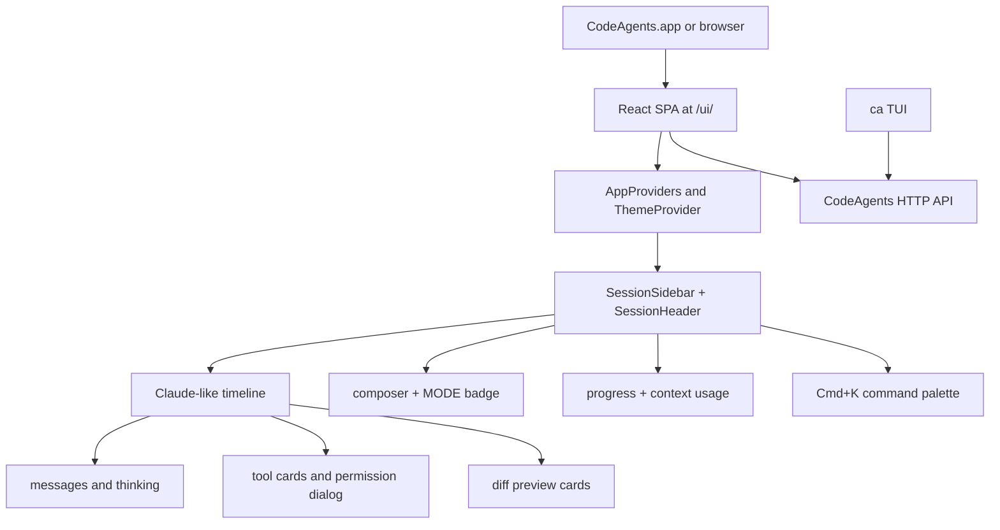

# Web GUI Architecture

## Goals

The GUI is a product UI over the same HTTP/NDJSON contract as the Rust TUI
(`ca`). It must not fork agent behavior: `ca`, the browser UI, and the desktop
launcher all talk to the same `codeagents serve` API.

The current implementation is a Vite + React SPA in [`gui/`](../gui/), served
at `/ui/` by `codeagents serve --gui-dir ...` and bundled into
`CodeAgents.app`.

## Reference Mapping

| Reference | What We Reuse | CodeAgents Implementation |
|-----------|---------------|---------------------------|
| `thirdparty/claude-code-source/ink.ts` | Single render/provider entry point | [`gui/src/components/AppProviders.tsx`](../gui/src/components/AppProviders.tsx) |
| `thirdparty/claude-code-source/components/design-system/ThemeProvider.tsx` | saved theme, preview, `auto` resolution | [`gui/src/design-system/ThemeProvider.tsx`](../gui/src/design-system/ThemeProvider.tsx) |
| `thirdparty/claude-code-source/components/AgentProgressLine.tsx` | compact tool/agent progress line with glyph hierarchy | [`gui/src/components/ChatTimeline.tsx`](../gui/src/components/ChatTimeline.tsx) (`ToolCard`) |
| `thirdparty/claude-code-source/components/BashModeProgress.tsx` | command/progress/output split | [`gui/src/components/TerminalPanel.tsx`](../gui/src/components/TerminalPanel.tsx) + tool cards |
| `thirdparty/claude-code-source/components/FileEditToolDiff.tsx` | framed lazy diff preview | [`gui/src/lib/timeline.ts`](../gui/src/lib/timeline.ts) (`extractDiffSummary`) + timeline diff cards |
| `thirdparty/opencode/packages/app/src/pages/layout.tsx` | sidebar + persisted session layout | [`gui/src/components/SessionSidebar.tsx`](../gui/src/components/SessionSidebar.tsx), [`gui/src/hooks/usePersistentState.ts`](../gui/src/hooks/usePersistentState.ts) |
| `thirdparty/opencode/packages/app/src/pages/session.tsx` | session timeline + composer | [`gui/src/App.tsx`](../gui/src/App.tsx), [`gui/src/components/Composer.tsx`](../gui/src/components/Composer.tsx) |
| OpenCode `Tab` mode toggle and `Cmd+K` palette | Tab cycles agent/plan/ask, palette as the only chrome | [`gui/src/App.tsx`](../gui/src/App.tsx), [`gui/src/components/CommandPalette.tsx`](../gui/src/components/CommandPalette.tsx) |
| OpenCode bottom status row | streaming progress bar + context-window readout | [`gui/src/components/StatusBar.tsx`](../gui/src/components/StatusBar.tsx) |
| `thirdparty/opencode/packages/desktop` | future desktop shell direction: main/preload/renderer, packaging | Current: chat-only Swift/WebKit launcher ([`scripts/macos/CodeAgentsApp.swift`](../scripts/macos/CodeAgentsApp.swift)); future: Electron/Tauri-style shell. |

## UI Shape

The UI is intentionally chat-only: no top-level tabs, no `Workspace` field, no
`Task` selector. The only chrome is the sidebar (chat list) and the bottom
composer plus a thin status bar.

### Keyboard Model

| Keys | Action |
|------|--------|
| `Tab` (outside text fields) | cycle mode `agent → plan → ask` |
| `Cmd+K` / `Ctrl+P` | open command palette |
| `Esc` | close palette |
| `↑` / `↓` + `Enter` | navigate / pick palette command |
| `Cmd/Ctrl + Enter` | send message |

### Workspace Defaulting

The composer never asks for a path. The browser sends an empty `workspace` and
[`src/codeagents/server.py`](../src/codeagents/server.py)'s `/chat/stream`
handler falls back to `Path.home()`. The agent itself navigates via tools when
the user instructs it where to work.

### Auto-Naming

After the first user message in a fresh chat, the GUI fires
`POST /chats/{id}/title` with that prompt. The server runs a one-shot
inference with a strict 3-5 word system prompt and persists the result via
`ChatStore.update_meta`. The call is fire-and-forget; failures are silent.

## State And Streaming

The GUI keeps saved chat state from `GET /chats/{id}` separate from live stream
state. Saved messages are converted with `wireMessagesToTimeline()`. Streaming
rows from `POST /chat/stream` are folded by `appendStreamRow()` into typed
timeline items:

- `delta` → live assistant block
- `thinking` → thinking block
- `tool_call_start` / `tool_call_delta` / `tool_call` / `tool_result` → one
  `ToolCard`
- `tool_pending` → permission card + dialog using `POST /chat/confirm`
- `terminal_output` → inline terminal block + bottom terminal panel
- `notice`, `model_info`, `done`, `error` → timeline status rows
- `context_usage` (added) → not appended; routed via `contextUsageFromRow()`
  into the bottom `StatusBar` (`prompt_tokens` / `total_tokens` /
  `context_window`)

## Desktop Shell

`CodeAgents.app` currently remains a native Swift/WebKit launcher. It starts
Ollama + `codeagents serve`, bundles `gui/dist`, and opens `/ui/` in a WebKit
tab. This keeps the TUI compatible because the API stays at
`http://127.0.0.1:8765`.

OpenCode's desktop package is the model for a future replacement:

- `main` process owns windows, menus, store, and service lifecycle.
- `preload` exposes a minimal bridge.
- `renderer` hosts the web UI.
- packaging is app-first rather than "open browser and run commands".

## Endpoints Used

| Method | Path | Role |
|--------|------|------|
| GET | `/health` | connectivity |
| GET | `/chats` | sidebar list |
| GET | `/chats/{id}` | load transcript |
| POST | `/chats` | create chat (`title`, `meta`) |
| PATCH | `/chats/{id}` | rename / merge meta without rewriting messages |
| DELETE | `/chats/{id}` | remove chat from disk |
| POST | `/chats/{id}/title` | model-generated 3-5 word title (auto-naming) |
| POST | `/chat/stream` | NDJSON agent turn (`chat`, `task`, `workspace`, optional `mode`) — empty `workspace` defaults to `$HOME` |
| POST | `/chat/upload` | base64 file → `.codeagents/uploads/` |
| POST | `/chat/confirm` | approve/deny pending tool (`decision_id`) |

## Tests

- Python: [`tests/test_server_cors.py`](../tests/test_server_cors.py),
  [`tests/test_server_gui_static.py`](../tests/test_server_gui_static.py),
  [`tests/test_server_chats_crud.py`](../tests/test_server_chats_crud.py),
  [`tests/test_stream_context_usage.py`](../tests/test_stream_context_usage.py)
- TypeScript: [`gui/src/lib/ndjson.test.ts`](../gui/src/lib/ndjson.test.ts),
  [`gui/src/lib/api.test.ts`](../gui/src/lib/api.test.ts),
  [`gui/src/lib/timeline.test.ts`](../gui/src/lib/timeline.test.ts),
  [`gui/src/components/CommandPalette.test.ts`](../gui/src/components/CommandPalette.test.ts)
